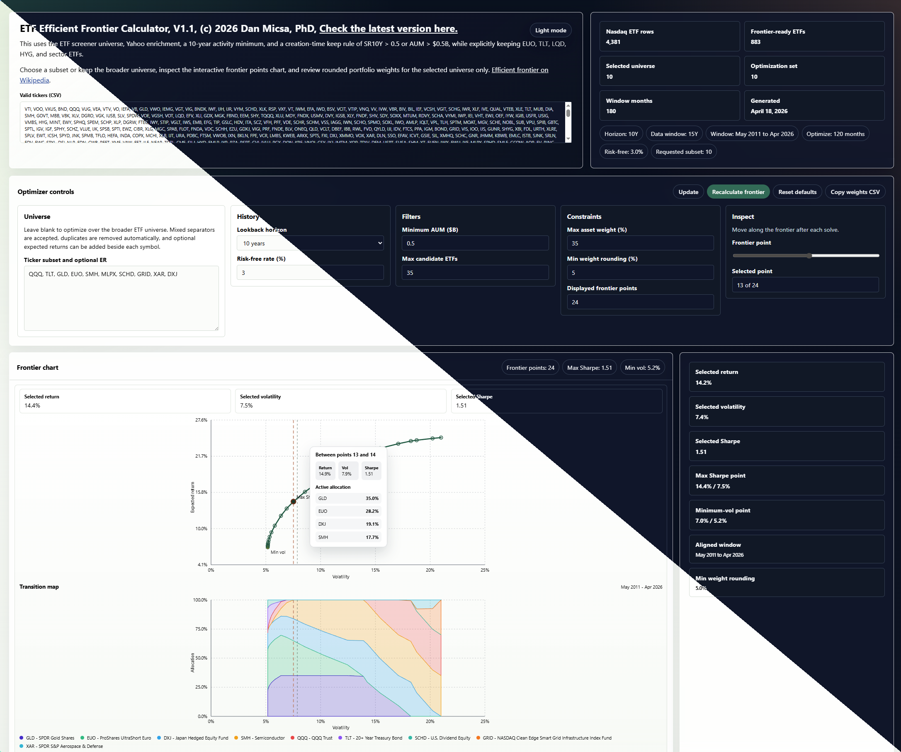

# ETF Efficient Frontier Calculator



If you do not want to generate your own copy, download `EfficientFrontier.html` and open it locally in your browser, or use [this link](https://htmlpreview.github.io/?https://github.com/dmicsa/EFCalculator/blob/main/EfficientFrontier.html).

This repository generates a static ETF efficient frontier explorer from the Nasdaq ETF universe.

The generator code lives in `Code\GenerateEfficientFrontier.ts`. The main output, `EfficientFrontier.html`, embeds the filtered ETF dataset together with the page styles and browser logic, so the generated file opens locally without additional assets.

## Prerequisites

- Deno 2.x
- Outbound network access to Nasdaq and Yahoo Finance

The current generator uses `yahoo-finance2`, which expects Deno 2.x.

In this workspace, the package can still emit a stale "found 1.40.3" warning even when the actual runtime is Deno 2.x, so confirm the real version with `deno --version` before treating that message as authoritative.

## Quick Start

From the repository root, run:

```powershell
.\GenerateEfficientFrontier.bat
```

That writes `EfficientFrontier.html` in the repository root. Open `EfficientFrontier.html` directly in a browser.

## Raw Deno Command

If you want to run the generator without the batch wrapper:

```powershell
deno run -A .\Code\GenerateEfficientFrontier.ts
```

The generator now writes to these root-level files by default:

- `EfficientFrontier.html`
- `Code\cache.json`

## Command-Line Options

- `--output=<path>`: output HTML file
- `--cache=<path>`: JSON cache used for enriched ETF data
- `--symbols=QQQ,TLT,GLD`: optional ticker subset; commas, spaces, tabs, newlines, and other non-ticker separators are all accepted

## Files In This Repo

- `Code\GenerateEfficientFrontier.ts`: the generator script
- `Code\frontier-app.js`: source of the browser-side optimization and interaction logic that is inlined into the generated HTML
- `Code\frontier-theme.css`: source of the page and chart styling that is inlined into the generated HTML
- `Code\Info.md`: the visible name/copyright line used in the first hero box and browser title
- `Code\EfficientFrontier-splash.png`: combined splash image shown at the top of this README
- `GenerateEfficientFrontier.bat`: root wrapper for generating the calculator
- `EfficientFrontier.html`: current generated frontier page, standalone for local viewing
- `Code\cache.json`: cached enrichment results

## What The Generated Page Contains

The generated page is a standalone static local HTML app with embedded ETF data and client-side controls. It includes:

- a default basket of `QQQ, TLT, GLD, EUO, SMH, MLPX, SCHD, GRID, XAR, DXJ`
- a ticker subset box that accepts mixed separators, removes duplicates, and supports optional expected-return overrides beside each ticker
- a valid-ticker CSV list in the first hero box that reflects the final creation-time filtered universe
- a long-only capped-weight efficient frontier rebuilt in the browser from embedded monthly returns
- an aligned transition map under the frontier chart, with synchronized hover reticles and a Max Sharpe reference line
- a selected-universe expected-return editor, plus rounded holdings and ticker/weight pair export
- a delayed busy cursor and centered `Calculating...` box when calculations take longer than 0.5 seconds

Clearing the ticker subset field switches the optimizer back to the broader filtered ETF universe.

## Refresh Behavior

- The cache TTL is 72 hours
- Delete `Code\cache.json` or point `--cache` at a different file to force a full refresh
- The output keeps only ETFs with at least 10 years of monthly history and either `SR10Y > 0.5` or `AUM > $0.5B`
- `EUO`, `TLT`, `LQD`, `HYG`, and sector ETFs are still preserved by the creation-time keep rule
- Very similar ETFs are pruned from the final output after sorting by AUM, so the more popular fund is kept first
- Some symbols are excluded intentionally in the generator (`SGOL`, `GLDM`, `BAR`)
- The embedded return payload is trimmed to the trailing 15-year monthly window to keep the generated page lighter

## Troubleshooting

- If the script fails early, check your Deno version with `deno --version`
- If `yahoo-finance2` prints an "Unsupported environment" warning that mentions Deno 1.40.3, verify the real runtime first; that warning can be stale even on Deno 2.x
- If the frontier is unavailable, relax the constraints or expand the ticker subset so the max-weight cap can produce a feasible portfolio set
- If you run the raw Deno command from outside the repository root, relative paths resolve from your current working directory; `GenerateEfficientFrontier.bat` avoids that by switching to the repo root first

## Copyright And Permission

Copyright (c) 2026 Dan Micsa, PhD.

Permission is hereby granted, free of charge, to any person obtaining a copy of this software and associated documentation files to use, copy, modify, merge, publish, distribute, sublicense, and/or sell copies of the software for any purpose, including commercial use, provided that this copyright notice and this permission notice are included in all copies or substantial portions of the software.

THE SOFTWARE IS PROVIDED "AS IS", WITHOUT WARRANTY OF ANY KIND, EXPRESS OR IMPLIED, INCLUDING BUT NOT LIMITED TO THE WARRANTIES OF MERCHANTABILITY, FITNESS FOR A PARTICULAR PURPOSE, AND NONINFRINGEMENT. IN NO EVENT SHALL THE AUTHOR BE LIABLE FOR ANY CLAIM, DAMAGES, OR OTHER LIABILITY, WHETHER IN AN ACTION OF CONTRACT, TORT, OR OTHERWISE, ARISING FROM, OUT OF, OR IN CONNECTION WITH THE SOFTWARE OR THE USE OR OTHER DEALINGS IN THE SOFTWARE.
